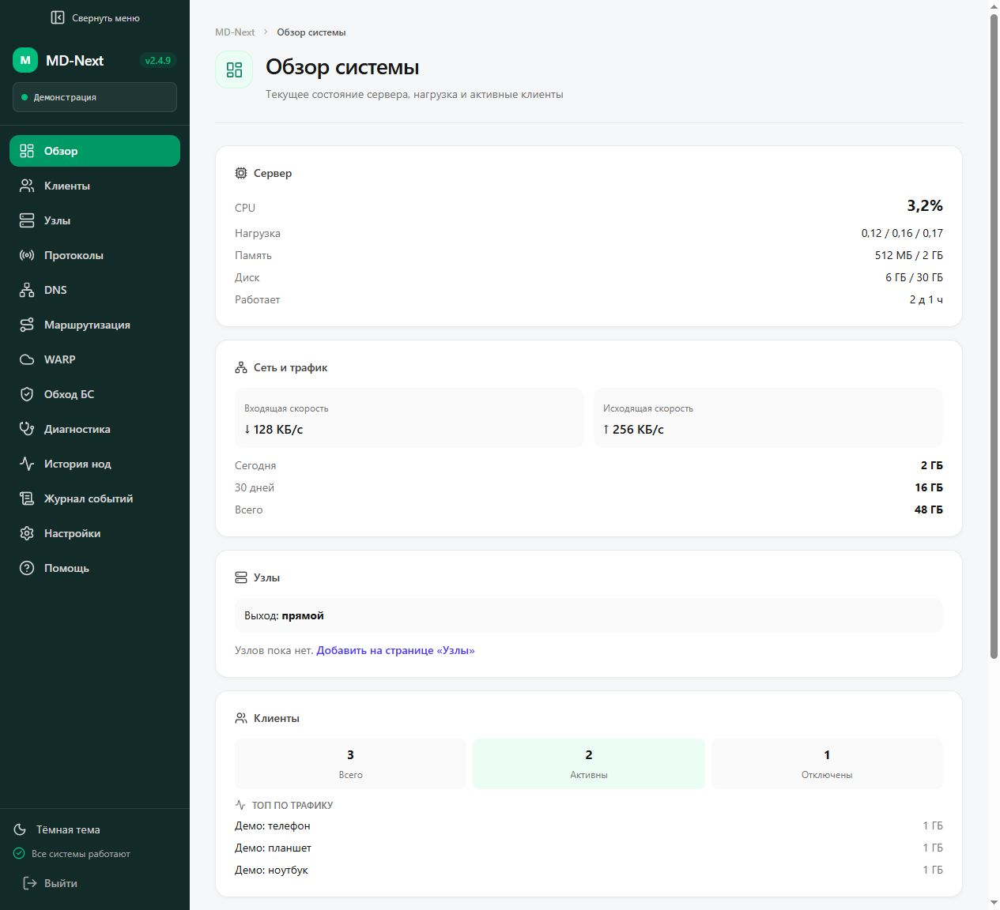
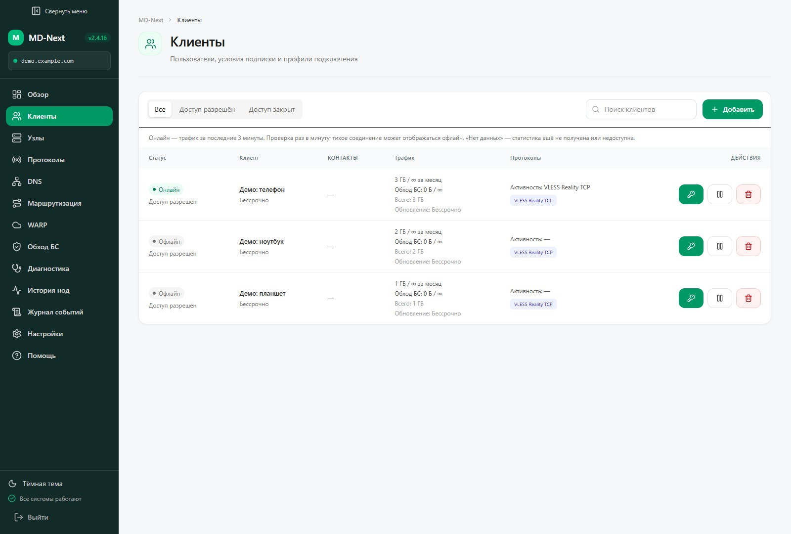
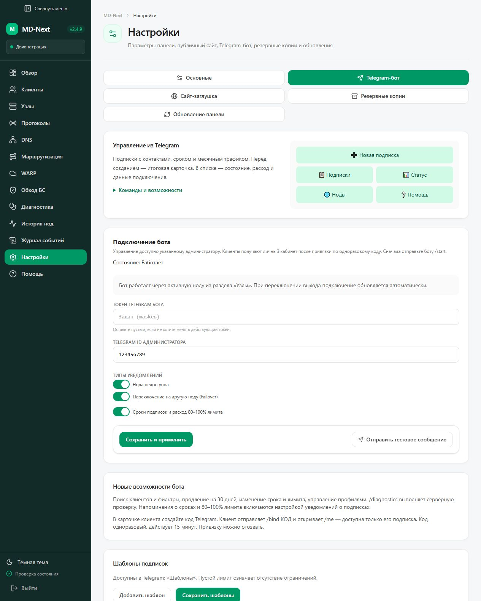

<p align="center">
  
</p>

Текущая версия: **2.4.15**. Демонстрационные скриншоты соответствуют этой версии.

<p align="center">
  <strong>Клиенты, подписки и VPN-инфраструктура — в одной панели.</strong><br />
  Веб-интерфейс и Telegram-бот для управления собственным сервером и кластером узлов.
</p>

<p align="center">
  <a href="LICENSE"></a>
  
  
  
</p>

## Возможности

### Интерфейс

Скриншоты интерфейса **2.4.9** с демонстрационными данными, без реальных клиентов, адресов серверов и секретов.



Клиенты: состояние подключения, активный протокол, настройка доступа и приостановка подписки.



Настройки Telegram-бота и предпросмотр его меню:



| Направление | Что доступно |
| --- | --- |
| Протоколы | VLESS Reality, VLESS XHTTP, Hysteria 2, AmneziaWG |
| Клиенты | Несколько профилей, включение и отключение доступа, QR-коды и ссылки подписок |
| Подписки | Срок действия, продление, месячный трафик и отдельный лимит CDN |
| Кластер | Управление узлами, выбор выхода и переключение на резервный узел |
| Маршруты | Прямое подключение, блокировка, прокси и WARP; настройка DNS |
| Telegram | Создание подписок, управление профилями, личный кабинет и уведомления |
| Наблюдение | Статистика, журнал событий, история доступности и диагностика |
| Администрирование | Двухфакторная аутентификация, резервные копии и восстановление |

AmneziaWG использует выбранный выход через TUN Xray. Подписки включают разрешённые протоколы; AmneziaWG выдаётся отдельным `.conf`-файлом. Совместимость зависит от приложения и его версии.

## Установка

Проверенные установкой и удалением системы: **Ubuntu 22.04, Ubuntu 24.04 и Debian 12, amd64**. Для arm64 предусмотрены загрузки upstream, но полный цикл установки пока не проверен. Alpine не поддерживается: установщик использует APT и systemd. Рекомендуется отдельный VPS от 1 CPU, 2 ГБ RAM и 10 ГБ диска; требования к трафику зависят от количества клиентов.

Быстрый запуск на чистом сервере:

```bash
curl -fsSL https://raw.githubusercontent.com/tro9n4ik/md-next/main/scripts/bootstrap.sh | sudo bash
```

Репозиторий публичный, авторизация GitHub для скачивания не нужна. Установщик выполняется с правами администратора; перед запуском можно скачать и просмотреть скрипт. Для воспроизводимости выбирайте проверенный коммит вместо `main` при клонировании.

Нужен виртуальный сервер Linux с правами администратора, основной домен и поддомен панели. Установщик предназначен для Ubuntu/Debian; совместимость системных компонентов зависит от версии ОС и ядра. Сначала направьте A-записи обоих доменов на сервер и обеспечьте доступ для выпуска TLS-сертификатов.

```bash
git clone https://github.com/tro9n4ik/md-next.git
cd md-next
sudo bash scripts/install.sh
```

В меню выберите установку. Скрипт запросит домены и электронную почту для Let's Encrypt, настроит службы и покажет пароль администратора. Сохраните пароль в надёжном месте. Для обновления откройте **Настройки → Обновление панели**: выбранная сборка устанавливается после проверок GitHub, с резервной копией и автоматическим откатом при ошибке. Подробности — в [руководстве по обновлению](docs/panel-updates.md).

Дочерние узлы подключаются по одноразовому приглашению из панели. Команда `scripts/join-node.sh` выполняется на сервере узла; URL приглашения содержит секрет и не должен публиковаться.

## Telegram-бот

Создайте бота через BotFather, укажите его токен и числовой Telegram ID администратора в панели. Отправьте боту `/start`, затем откройте `/menu`.

- `/new_subscription` — создание подписки с выбором срока и лимита.
- `/subscriptions` — список подписок и управление доступом.
- `/diagnostics` — серверная проверка подключения.
- `/me` — личный кабинет клиента после привязки одноразовым кодом.

Бот работает через активную выходную ноду и следует за её переключением. Настройки уведомлений находятся в **Настройки → Telegram-бот**.

Меню, поиск и мастер подписки обновляют одну рабочую карточку. Системные события обновляют отдельную карточку последнего события, а напоминания о подписках объединяются в сводки. Диагностика показывает ход проверки и результат в одном сообщении; JSON-отчёт скачивается по кнопке. Идентификаторы карточек сохраняются после перезапуска бота.

Старая переписка автоматически не удаляется. Редактирование существующей карточки не вызывает нового звукового уведомления Telegram; полная история событий доступна в панели.

## Блокировка рекламы

В **Клиенты → Настроить доступ** включите **Блокировка рекламы (AdBlock)** для нужного клиента и сохраните доступ. По умолчанию она выключена. Xray блокирует рекламные домены из geosite:category-ads-all до правил выхода через ноды и WARP; AmneziaWG определяется по внутреннему IP клиента. Нужен файл geosite.dat из установки Xray.

В Happ обновите подписку, чтобы получить правило и для прямого трафика. Фильтрация не убирает рекламу с того же домена, что и основной контент; правила в других приложениях для прямого трафика настраиваются отдельно.

## Резервные копии

```bash
sudo bash scripts/backup.sh
sudo bash scripts/backup.sh --list
```

По умолчанию сохраняются последние 7 архивов в `/var/backups/md-next`. Копия содержит базу, `.env` и конфигурации с приватными ключами — храните её отдельно от репозитория.

## Безопасность

**Новая установка запускает backend от пользователя `md-next`.** Системные операции выполняет отдельный root-помощник с фиксированным набором команд. Код приложения принадлежит root и недоступен backend для записи. Старые установки до 2.4.15 могут продолжать работать от root; обновление переводит их на новую схему. Приложение всё ещё хранит данные подключения и обращается к привилегированному помощнику, поэтому защита API и обновлений остаётся обязательной. Текущие меры и границы проверки описаны в [отчёте аудита](docs/public-security-audit.md).

Используйте уникальный пароль и включите 2FA. Управляющие API требуют авторизации. Не открывайте локальные SOCKS5-прокси и внутренние API в интернет. Секреты хранятся в серверном `.env`; [пример переменных](backend/.env.example) содержит только шаблон конфигурации.

Дополнительная защита Nginx, Fail2ban и наблюдение за сканерами описаны в [руководстве по защите входного сервера](docs/edge-security.md). Эти меры не гарантируют устойчивость к любой блокировке.

## Документация

- [Обновление панели из настроек](docs/panel-updates.md)

- [Локальная разработка через виртуальное окружение](docs/development.md)
- [Проверка перед публичной публикацией](docs/public-security-audit.md)
- [Лицензии сторонних компонентов](docs/third-party-notices.md)

- [Личные страницы подписок](docs/subscription-pages.md)
- [Подготовка CDN](docs/cdn-setup.md)
- [Возможности панели и бота](docs/release-2.4.md)
- [История изменений](CHANGELOG.md)
- [Сообщение об уязвимостях](SECURITY.md)

## Структура

```text
backend/   Сервер: FastAPI, база данных, миграции, Telegram-бот
frontend/  React, TypeScript, интерфейс панели
scripts/   Установка, обновление, маршрутизация и резервные копии
docs/      Руководства и ресурсы проекта
```

Для сборки интерфейса: `cd frontend && npm ci && npm run build`. Для серверной части используйте виртуальное окружение и `backend/requirements.txt`; перед запуском примените миграции командой `alembic upgrade head`. Исходники, миграции и файлы зависимостей входят в репозиторий; локальные базы, сборки и окружения исключены.

## Границы проверки

Часть сетевых функций пока проверена только автоматически или в лабораторных условиях. Работа всех протоколов во всех VPN-приложениях, CDN в ограниченной сети и полный цикл автоматического отката не гарантируются без отдельных проверок. Текущее состояние и план приведены в [списке проверок выпуска](docs/release-readiness.md).

## Лицензия

Проект распространяется под [MIT](LICENSE). Доступен [перевод лицензии на русский](LICENSE.ru.md).

Xray и AmneziaWG сохраняют собственные лицензии; см. [уведомления о сторонних компонентах](docs/third-party-notices.md). Готовые бинарники этих компонентов в репозитории не поставляются.

## Ответственность

MD-Next предназначен для управления собственными серверами или серверами, на использование которых у вас есть разрешение. Пользователь отвечает за соблюдение применимых законов и правил провайдера.

Обновления зависимостей проверяет Dependabot каждую неделю: Python, npm и GitHub Actions. Перед выпуском CI сверяет номер версии, README, CHANGELOG и манифест скриншотов. При смене версии обновите скриншоты и их SHA-256 в docs/assets/screenshots.json, затем запустите python scripts/check-release-consistency.py.
